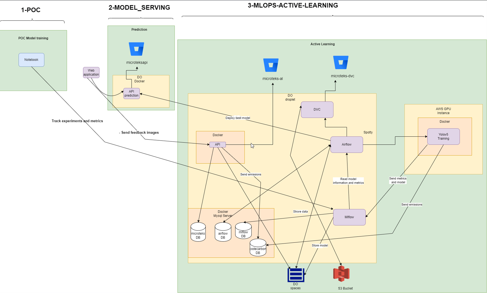
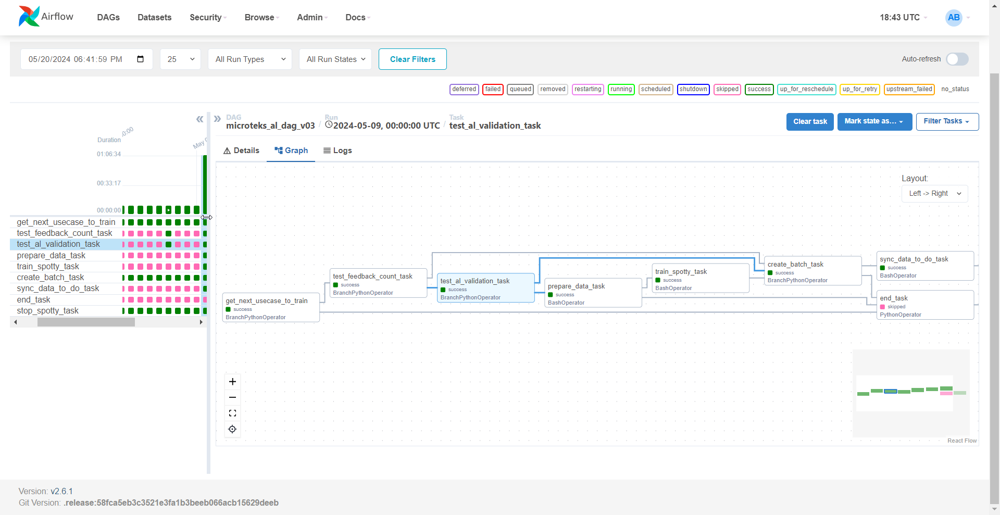

# Project Architecture 
The project is composed of three main parts :
## 1. POC (Proof of Concept)
- **Notebook**: This is where the initial model training happens. Jupyter notebooks (Colan) is used to develop and experiment  different models.
- **Track experiments and metrics**: During this phase, experiments and their respective metrics are tracked using MLFLOW. This information is critical for comparing model performance and selecting the best models for deployment.

## 2. Model Serving
- **Web application**: Users interact with the model through a web application. This application sends data to the model for predictions.
- **API prediction**: The web application communicates with an API (FAstAPI) hosted in a Docker container (DO Docker) to get model predictions.
- **DO Docker**: Refers to a Docker container, hosted on DigitalOcean (DO), that serves the model API.

## 3. MLOps - Active Learning
This is a process where the model actively learns and improves from new data. Feedback loops are established to enhance model performance over time.
- **microteks-al**: This git repository handles the active learning process.
- **microteks-dvc**: Integrates Data Version Control (DVC) for managing datasets and model versions .
- **Airflow**: Orchestrates the workflow for training and deploying models. It reads model information and metrics, possibly triggering retraining or deployment workflows.
 
- **Mlflow**: Used for tracking experiments, managing model lifecycle, and storing model artifacts.
  
- **AWS GPU Instance**: Utilized for intensive model training tasks, such as training YOLOv5 models.
- **Docker**: Containerization technology used to deploy models and applications.
- **DO Spaces and S3 Bucket**: Storage solutions (DigitalOcean Spaces and Amazon S3) for storing data and models.
- **Databases**: Several databases are hosted in Docker containers for storing different types of data:
  - **microteks DB**: Likely stores application-specific data.
  - **airflow DB**: Stores metadata and state information for Apache Airflow workflows.
  - **mlflow DB**: Stores tracking information for MLflow experiments.
  - **codecarbon DB**: Likely stores emissions data related to model training and inference.

## Key Interactions
- The web application sends prediction requests to the API, which runs in a Docker container.
- Feedback from predictions is used in the active learning component to continually improve model performance.
- DVC, Airflow, and Mlflow are integrated to manage data, orchestrate workflows, and track model metrics.
- Data storage solutions (DO Spaces, S3 Bucket) ensure all data and models are securely stored and versioned.
- CI/CD is managed using Bitbucket pipelines

This architecture supports a robust and scalable machine learning workflow, facilitating continuous improvement and deployment of models through active learning and comprehensive MLOps practices.
